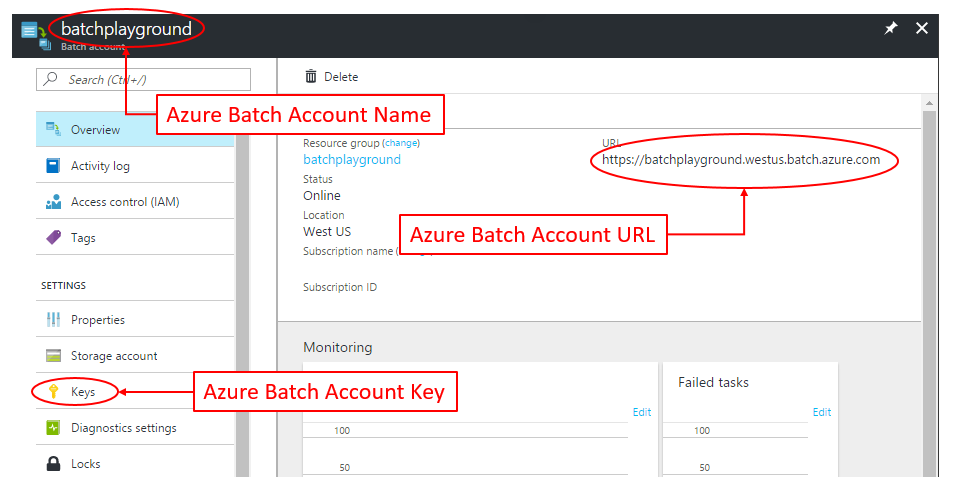
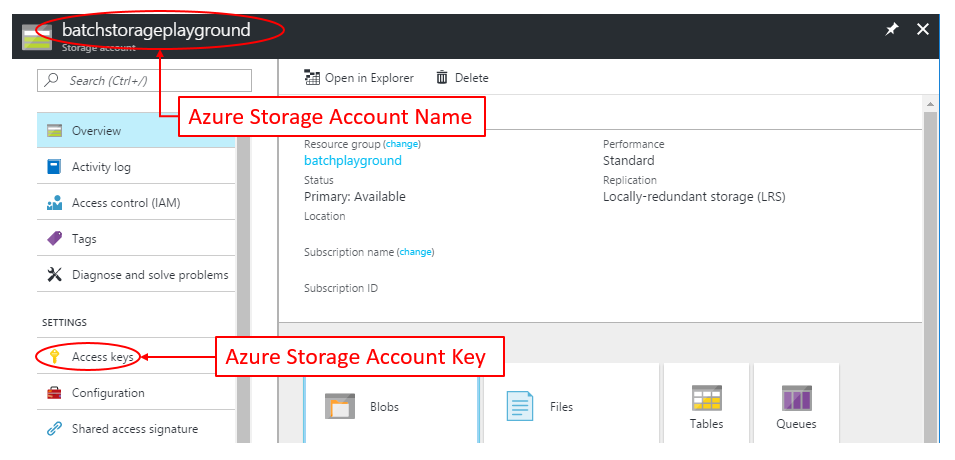

# doAzureParallel

The *doAzureParallel* package is a parallel backend for the widely popular *foreach* package. With *doAzureParallel*, each iteration of the *foreach* loop runs in parallel on an Azure Virtual Machine (VM), allowing users to scale up their R jobs to tens or hundreds of machines.

*doAzureParallel* is built to support the *foreach* parallel computing package. The *foreach* package supports parallel execution - it can execute multiple processes across some parallel backend. With just a few lines of code, the *doAzureParallel* package helps create a cluster in Azure, register it as a parallel backend, and seamlessly connects to the *foreach* package.

## Dependencies

- R (>= 3.3.1)
- httr (>= 1.2.1)
- rjson (>= 0.2.15)
- RCurl (>= 1.95-4.8)
- digest (>= 0.6.9)
- foreach (>= 1.4.3)
- iterators (>= 1.0.8)

## Installation 

Install doAzureParallel directly from Github.

```R
# install the package devtools
install.packages("devtools")
library(devtools)

# install the doAzureParallel and rAzureBatch package
install_github(c("Azure/rAzureBatch", "Azure/doAzureParallel"))
```

## Azure Requirements

To run your R code across a cluster in Azure, we'll need to get keys and account information.

### Setup Azure Account
First, set up your Azure Account ([Get started for free!](https://azure.microsoft.com/en-us/free/))

Once you have an Azure account, you'll need to create the following two services in the Azure portal:
- Azure Batch Account ([Create an Azure Batch Account in the Portal](https://docs.microsoft.com/en-us/azure/Batch/batch-account-create-portal))
- Azure Storage Account (this can be created with the Batch Account)

### Get Keys and Account Information
For your Azure Batch Account, we need to get:
- Batch Account Name
- Batch Account URL
- Batch Account Access Key

This information can be found in the Azure Portal inside your Batch Account:



For your Azure Storage Account, we need to get:
- Storage Account Name
- Storage Account Access Key

This information can be found in the Azure Portal inside your Azure Storage Account:



Keep track of the above keys and account information as it will be used to connect your R session with Azure.

## Getting Started

Import the package
```R
library(doAzureParallel)
```

Set up your parallel backend with Azure
```R
# 1. Generate a pool configuration file.  
generatePoolConfig("my_pool_config.json")

# 2. Edit your pool configuration file.
# Enter your Azure Batch Account & Azure Storage keys/account-info and configure your pool settings.

# 3. Register the pool. This will create a new pool if your pool hasn't already been provisioned.
pool <- registerPool("my_pool_config.json")

# 4. Register the pool as your parallel backend
registerDoAzureParallel

# 5. Check that your parallel backend has been registered
getDoParWorkers()
```

Run your parallel *foreach* loop with the *%dopar%* keyword. The *foreach* function will return the results of your parallel code.

```R
number_of_iterations <- 10
results <- foreach(i = 1:number_of_iterations) %dopar% {
  # This code is executed, in parallel, across your Azure cluster
}
```

When developing at scale, it is always recommended that you test and debug your code locally first. Switch between *%dopar%* and *%do%* to toggle between running in parallel on Azure and running in sequence on your local machine.

```R 
# run your code sequentially on your local machine
results <- foreach(i = 1:number_of_iterations) %do% { ... }

# use the doAzureParallel backend to run your code in parallel across your Azure cluster
results <- foreach(i = 1:number_of_iterations) %dopar% { ... }
```

### Pool Configuration JSON

Use your pool configuration JSON file to define your cluster in Azure.

```javascript
{
  "batchAccount": {
    "name": <Azure Batch Account Name>,
    "key": <Azure Batch Account Key>,
    "url": <Azure Batch Account URL>,
    "pool": {
      "name": <your cluster name>, // example: "my_new_azure_cluster"
      "vmsize": <your cluster VM size identifier>, // example: "Standard_A1_v2"
      "poolSize": {
        "targetDedicated": <number of node you want in your cluster>, // example: 10
      }
    },
    "rPackages": {
      "cran": {
        "source": "http://cran.us.r-project.org",
        "name": ["some_cran_package", "some_other_cran_package"]
      },
      "github": ["username/some_github_package", "another_username/some_other_github_package"]
    }
  },
  "storageAccount": {
    "name": <Azure Storage Account Name>,
    "key": <Azure Storage Account Key>
  },
  "settings": {
    "verbose": false
  }
}
```

## Contributing

This project has adopted the [Microsoft Open Source Code of Conduct](https://opensource.microsoft.com/codeofconduct/). For more information see the [Code of Conduct FAQ](https://opensource.microsoft.com/codeofconduct/faq/) or contact [opencode@microsoft.com](mailto:opencode@microsoft.com) with any additional questions or comments.
